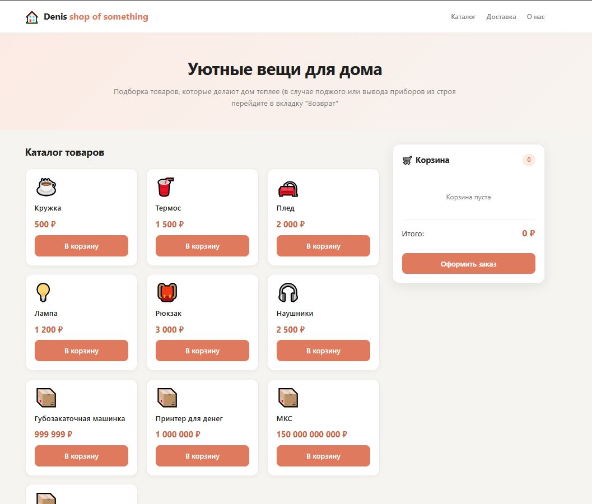
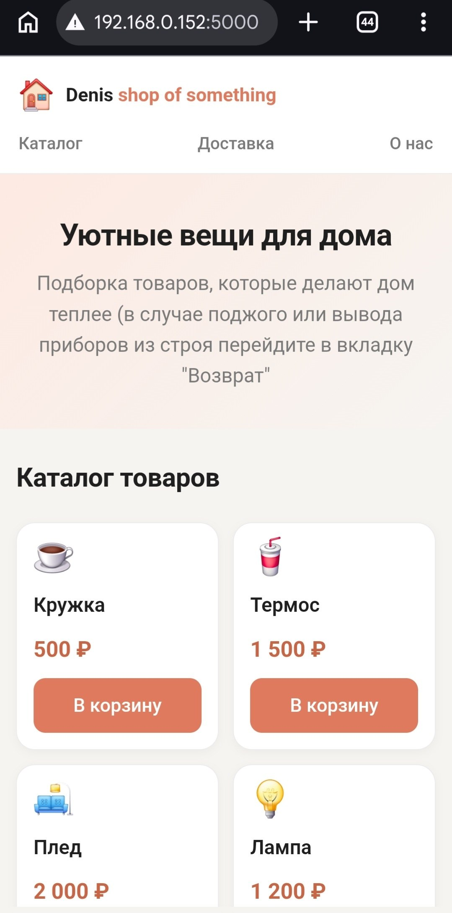

# 🏠 CozyHome - интернет-магазин

Учебный проект - интернет-магазин товаров для дома с каталогом, корзиной и оформлением заказа.

**Лабораторная работа №1** по дисциплине «Web-разработка».

---

## 🔗 Демо

**[Открыть сайт](https://DenisNikolsky.github.io/Web-lab-1/)**

> Замените ссылку выше на адрес вашего GitHub Pages.

---

## ✨ Возможности

- 🛍️ **Каталог товаров** - карточки с эмодзи, названием и ценой
- 🛒 **Корзина** - добавление, удаление, изменение количества
- 💾 **Сохранение в `localStorage`** - корзина не пропадает после перезагрузки
- 💰 **Автоматический пересчёт** итоговой суммы
- 📝 **Оформление заказа** в модальном окне
- ✅ **Валидация формы** - телефон (обязательно), email (по желанию)
- 📱 **Адаптивная вёрстка** - корректно работает на ноутбуках, планшетах и смартфонах
- 🚧 **Страница-заглушка** для ссылок «Доставка», «О нас», «Контакты» и др.

---

## 🛠️ Стек технологий

| Технология | Применение |
|---|---|
| **HTML5** | Семантическая разметка (`header`, `main`, `section`, `aside`, `article`, `footer`, `dialog`, `form`) |
| **CSS3** | Grid, Flexbox, CSS-переменные, медиазапросы, hover-анимации |
| **JavaScript (ES6+)** | Работа с DOM, события, массивы, объекты, JSON |
| **LocalStorage API** | Сохранение состояния корзины между сессиями |

> **Без фреймворков** - только чистый HTML, CSS и JavaScript, как требует задание.

---

## 📁 Структура проекта

```
Lab_1/
├── index.html          # Главная страница магазина
├── in-progress.html    # Страница-заглушка для ссылок футера
├── styles.css          # Все стили
├── script.js           # Логика корзины, формы и валидации
└── README.md
```

---

## 🚀 Запуск локально

Проект не требует сборки - достаточно открыть `index.html` в браузере.

Однако для корректной работы `localStorage` и относительных путей рекомендуется запустить локальный сервер:

```bash
npx serve .
```

Или через Python:

```bash
python -m http.server 8000
```

Затем откройте [http://localhost:8000](http://localhost:8000).

---

## 🧠 Как это работает

### Корзина

- Товары хранятся в массиве `products` в `script.js`.
- Корзина - массив объектов `{ id, title, price, quantity }`.
- При любом изменении корзина сохраняется в `localStorage` под ключом `shop-cart`.
- При загрузке страницы корзина восстанавливается и отрисовывается заново.

### Валидация формы

- **Имя, фамилия, адрес** - обязательные, минимальная длина.
- **Телефон** - обязательный, автоматически форматируется в `+7 (XXX) XXX-XX-XX`, проверяется по количеству цифр (10–15).
- **Email** - необязательный. Если заполнен, проверяется регуляркой.
- Ошибки показываются под полями, невалидное поле подсвечивается.

### Оформление заказа

1. Пользователь нажимает «Оформить заказ» в корзине.
2. Открывается модальное окно `<dialog>` с формой.
3. После успешной валидации показывается сообщение «Заказ создан!».
4. Корзина очищается.

---

## 📸 Скриншоты

### Десктоп
<!-- Вставьте сюда скриншот главной страницы -->


### Мобильная версия
<!-- Вставьте сюда скриншот на телефоне -->

---

## ✅ Реализованные требования

<details>
<summary>Развернуть чек-лист</summary>

### Макет и вёрстка
- [x] HTML-страница магазина с карточками товаров
- [x] Семантическая разметка
- [x] Форма заказа с обязательными полями
- [x] Использование CSS Grid и Flexbox
- [x] Адаптивность для ноутбука, планшета и смартфона

### Логика корзины
- [x] Добавление товара в корзину
- [x] Удаление товара из корзины
- [x] Изменение количества с автоматическим пересчётом
- [x] Сохранение в `localStorage`
- [x] Корректное отображение итоговой суммы

### Форма заказа
- [x] Открывается в модальном окне
- [x] Сообщение «Заказ создан!» после отправки
- [x] Валидация телефона и email (бонус)

</details>